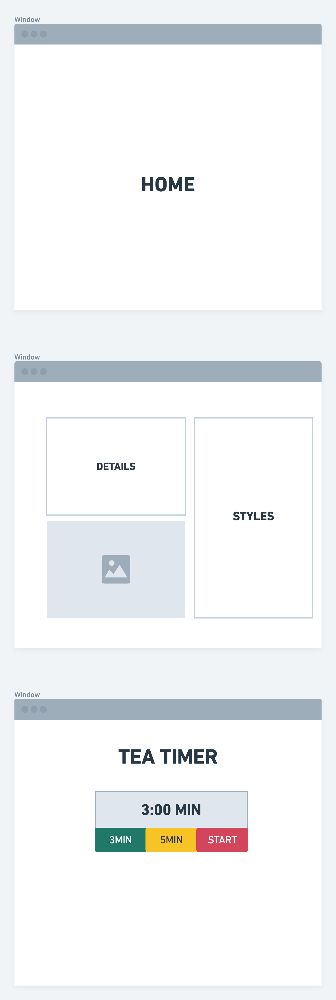
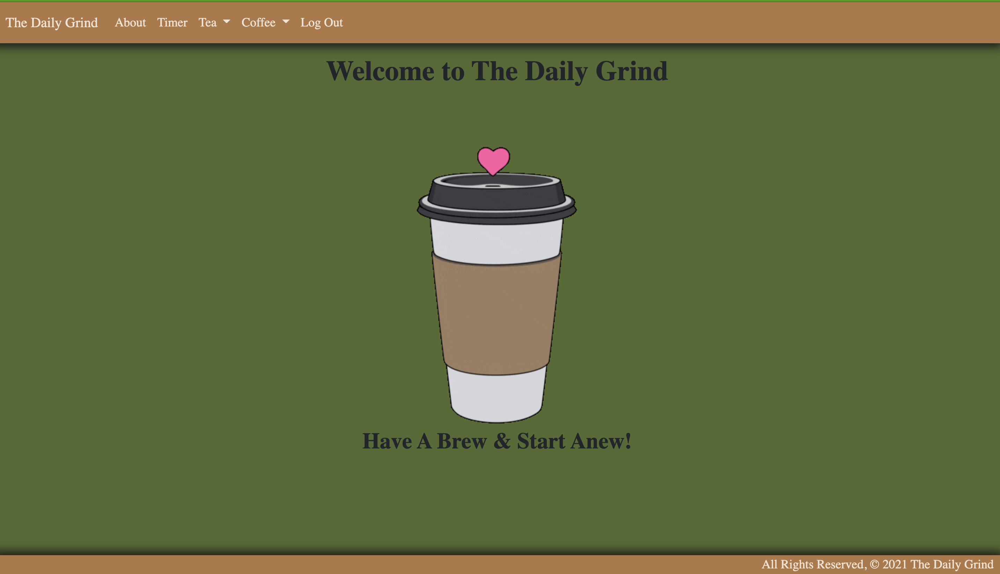
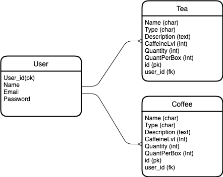
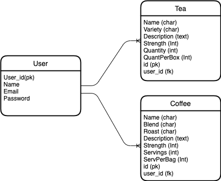

# The Daily Grind

## View Application [Here!](https://the-daily-grind2021.herokuapp.com/)

## Wireframe Images:

## Final App Images:

## Trello:

Here is a link to my [Trello](https://trello.com/b/KTqlafnG/daily-dose)...

## ERD:

### Original Concept:

### Final ERD:

## Description:
The Daily Grind is a Full CRUD Python/Django application with implemented authentication that allows users to keep track of kinds and quantities of teas and coffees. The application also includes a scripted Javascript timer for brew/steeping times.
## Instructions:

1. Open App
2. Sign up/Log in
3. Add teas and coffees to database
4. Brew and Restock accordingly
5. Use 'Timer' to set timer for steeping tea at 2min, 3min & 5min intervals

## Technologies Used:

- HTML
- CSS
- JavaScript
- BootStrap 4.5
- Python
- Django
- PostgreSQL
- Heroku Deployment
- Django Auth
- Django Template

## Next Steps:

- [ ] Favicon
- [ ] Fix timer width to be percent of total time instead of per minute
- [ ] Timer sound on completion
- [ ] Photos of Tea/Coffee
- [ ] Shared Lists?
- [ ] 'Explore' page to post recipes for others to try

## Attributions:

While the below disclaimers are technically required by their license-holders; I would like to also sincerely thank all the creators whose work makes this site look great. I do not own nor am I associated with the resources used in any way. Thank you!
